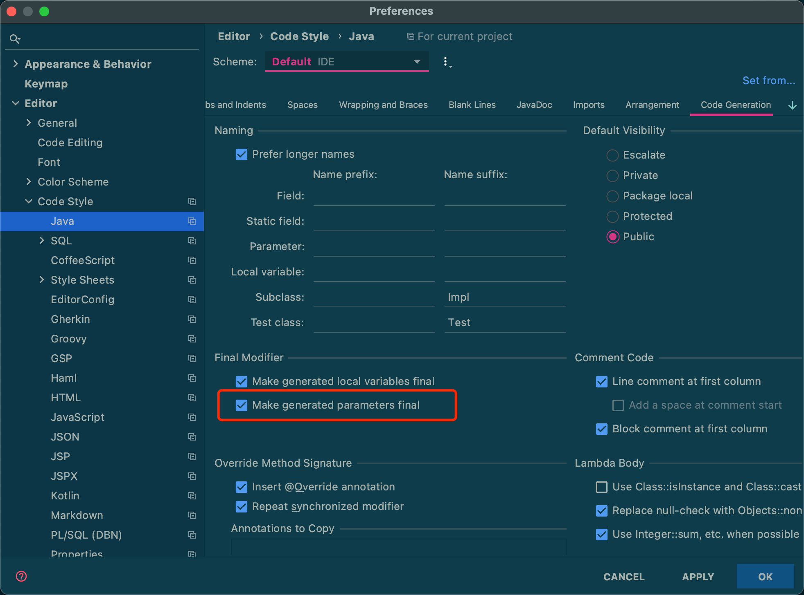

# Final Parameters


## What

方法参数必须使用`final`修饰。

* 示例：

```java
public void method(final String finalParameter){
    // do something
}
```


## Rule

```xml
<!-- 参数使用 final 修饰 -->
<module name="FinalParameters"/>
```


## Idea

在`Preferences`-->`Editor`-->`Code Style`-->`Java`-->`Code Generation`中勾选`Make generated parameters final`。

